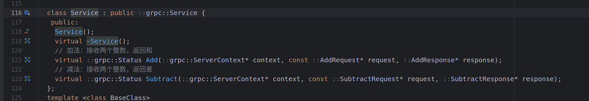

### grpc-cpp-demo
这是一个grpc的加减法demo。


### 前置准备
确保已安装：
- gRPC库（含protobuf）：`sudo apt install libgrpc++-dev libprotobuf-dev protobuf-compiler-grpc`（Ubuntu示例，其他系统参考官方文档）
- 编译器：g++（支持C++11及以上）
- 目录：创建一个空文件夹（如`grpc_demo`），后续所有文件都放在这里。


### 步骤1：定义服务接口（.proto文件）
gRPC的核心是“接口先行”，先用protobuf定义服务和消息格式。

**操作**：  
在`grpc_demo/proto`文件夹中创建`calculator.proto`文件，内容如下：
```protobuf
syntax = "proto3";  // 使用 proto3 语法

// 加法请求：包含两个操作数
message AddRequest {
  int32 a = 1;  // 第一个数
  int32 b = 2;  // 第二个数
}

// 加法响应：包含结果
message AddResponse {
  int32 result = 1;  // 和
}

// 减法请求：包含两个操作数
message SubtractRequest {
  int32 a = 1;  // 被减数
  int32 b = 2;  // 减数
}

// 减法响应：包含结果
message SubtractResponse {
  int32 result = 1;  // 差
}

// 定义服务：计算器
service Calculator {
  // 加法：接收两个整数，返回和
  rpc Add(AddRequest) returns (AddResponse);
  // 减法：接收两个整数，返回差
  rpc Subtract(SubtractRequest) returns (SubtractResponse);
}
```

**解释**：
- `.proto`文件是服务端和客户端的“契约”，双方必须遵守这个接口定义才能通信。
- `service Calculator`定义了服务包含的RPC方法（Add/Subtract）。
- `message`定义了方法的输入（Request）和输出（Response）的数据结构。

通俗的讲，我这里定义了加法的请求和响应，并在服务中定义了类似加法的函数。减法同理。

### 步骤2：生成C++代码（从.proto到可调用的框架代码）
protobuf和gRPC会根据`.proto`文件自动生成C++代码（包含消息序列化和RPC调用框架）。

**操作**：  
在`grpc_demo`文件夹中打开终端，执行以下命令：
```bash
chmod +x scripts/proto.sh
./scripts/proto.sh
```
这个`proto.sh`脚本，还是挺好用的。

**执行后会在`src/generated`生成4个文件**：
- `calculator.pb.h`：消息类的头文件（如`AddRequest`、`AddResponse`的声明）。
- `calculator.pb.cc`：消息类的实现（序列化/反序列化逻辑）。
- `calculator.grpc.pb.h`：gRPC服务的头文件（包含服务端接口和客户端）。
- `calculator.grpc.pb.cc`：gRPC服务的实现（RPC调用的底层逻辑）。


### 步骤3：编写服务端代码（实现RPC方法并启动服务）
我们可以发现，`.proto`中的`service`中`Add`和`Subtract`还没有写。

服务端需要“实现”`.proto`中定义的`Calculator`服务，即编写`Add`和`Subtract`方法的具体逻辑，并启动服务监听客户端请求。


#### 3.1 服务端代码结构
服务端代码分为两部分：
1. 实现`Calculator`服务的具体逻辑（继承自动生成的`Calculator::Service`）。
2. 启动服务端（绑定地址、注册服务、监听端口）。


#### 3.2 编写服务端代码（`server.cpp`）
**创建`src/server.cpp`，按以下步骤编写**：

##### 第一步：包含必要的头文件
```cpp
// 标准库头文件
#include <iostream>
#include <memory>  // 用于unique_ptr
#include <string>

// gRPC头文件
#include <grpcpp/grpcpp.h>

// 生成的protobuf和gRPC头文件（步骤2生成）
#include "calculator.grpc.pb.h"
```

##### 第二步：定义服务实现类（继承自动生成的服务基类）
gRPC自动生成的`Calculator::Service`是一个抽象类，需要我们继承并实现其中的纯虚方法（`Add`和`Subtract`）。

```cpp
// 使用gRPC的命名空间（简化代码）
using grpc::Server;
using grpc::ServerBuilder;
using grpc::ServerContext;
using grpc::Status;

// 继承Calculator::Service，实现具体的RPC方法
class CalculatorServiceImpl final : public Calculator::Service {
  // 实现Add方法：处理客户端的加法请求
  // 参数说明：
  // - ServerContext*：RPC上下文（包含元数据、超时等）
  // - const AddRequest*：客户端发送的请求数据
  // - AddResponse*：要返回给客户端的响应数据
  // 返回值：Status（表示调用是否成功）
  Status Add(ServerContext* context, const AddRequest* request,
             AddResponse* response) override {
    // 1. 从请求中获取参数a和b
    int32_t a = request->a();
    int32_t b = request->b();

    // 2. 执行加法计算
    int32_t result = a + b;

    // 3. 将结果存入响应
    response->set_result(result);

    // 4. 打印日志（可选）
    std::cout << "服务端：处理加法请求 " << a << " + " << b << " = " << result << std::endl;

    // 5. 返回成功状态
    return Status::OK;
  }

  // 实现Subtract方法：处理减法请求（逻辑类似Add）
  Status Subtract(ServerContext* context, const SubtractRequest* request,
                  SubtractResponse* response) override {
    int32_t a = request->a();
    int32_t b = request->b();
    int32_t result = a - b;
    response->set_result(result);
    std::cout << "服务端：处理减法请求 " << a << " - " << b << " = " << result << std::endl;
    return Status::OK;
  }
};
```

##### 第三步：编写启动服务端的函数
```cpp
// 启动服务端的函数
void RunServer() {
  // 1. 定义服务端监听的地址和端口（0.0.0.0表示监听所有网卡）
  std::string server_address("0.0.0.0:50051");

  // 2. 创建服务实现类的实例
  CalculatorServiceImpl service;

  // 3. 配置服务端（使用ServerBuilder）
  ServerBuilder builder;
  // 绑定监听地址（使用不加密的凭据，生产环境可能需要加密）
  builder.AddListeningPort(server_address, grpc::InsecureServerCredentials());
  // 注册服务（将我们实现的service注册到服务端）
  builder.RegisterService(&service);

  // 4. 构建并启动服务
  std::unique_ptr<Server> server(builder.BuildAndStart());
  std::cout << "服务端已启动，监听地址：" << server_address << std::endl;

  // 5. 阻塞等待服务端关闭（按Ctrl+C退出）
  server->Wait();
}
```

##### 第四步：主函数调用启动函数
```cpp
int main(int argc, char**argv) {
  RunServer();  // 启动服务端
  return 0;
}
```


### 步骤4：编写客户端代码（调用远程RPC方法）
客户端需要通过gRPC自动生成的“Stub”（存根）调用服务端的`Add`和`Subtract`方法，Stub会自动处理网络通信细节。

#### 4.1 客户端代码结构
客户端代码主要做三件事：
1. 连接服务端（通过网络地址）。
2. 创建Stub对象（用于调用RPC方法）。
3. 构造请求消息，调用Stub的方法，处理响应。


#### 4.2 编写客户端代码（`client.cpp`）
**创建`src/client.cpp`，按以下步骤编写**：

##### 第一步：包含必要的头文件
```cpp
// 标准库头文件
#include <iostream>
#include <memory>
#include <string>

// gRPC头文件
#include <grpcpp/grpcpp.h>

// 生成的头文件（和服务端相同）
#include "calculator.grpc.pb.h"
```

##### 第二步：定义客户端类（封装RPC调用）
```cpp
using grpc::Channel;
using grpc::ClientContext;
using grpc::Status;

// 客户端类：通过Channel连接服务端，使用Stub调用RPC
class CalculatorClient {
public:
  // 构造函数：接收一个gRPC通道（用于连接服务端）
  CalculatorClient(std::shared_ptr<Channel> channel)
      : stub_(Calculator::NewStub(channel)) {}  // 创建Stub对象

  // 封装Add方法的调用（对外提供像本地函数一样的接口）
  int32_t Add(int32_t a, int32_t b) {
    // 1. 构造请求消息
    AddRequest request;
    request.set_a(a);  // 设置请求参数a
    request.set_b(b);  // 设置请求参数b

    // 2. 准备接收响应的对象
    AddResponse response;

    // 3. 创建RPC上下文（可设置超时、元数据等）
    ClientContext context;

    // 4. 调用Stub的Add方法（实际发起远程调用）
    Status status = stub_->Add(&context, request, &response);

    // 5. 处理调用结果
    if (status.ok()) {
      // 调用成功：返回响应结果
      return response.result();
    } else {
      // 调用失败：打印错误信息
      std::cout << "客户端：加法调用失败，错误码：" << status.error_code() 
                << "，信息：" << status.error_message() << std::endl;
      return -1;  // 返回错误标识
    }
  }

  // 封装Subtract方法的调用（逻辑类似Add）
  int32_t Subtract(int32_t a, int32_t b) {
    SubtractRequest request;
    request.set_a(a);
    request.set_b(b);

    SubtractResponse response;
    ClientContext context;

    Status status = stub_->Subtract(&context, request, &response);

    if (status.ok()) {
      return response.result();
    } else {
      std::cout << "客户端：减法调用失败，错误码：" << status.error_code() 
                << "，信息：" << status.error_message() << std::endl;
      return -1;
    }
  }

private:
  // Stub对象：由gRPC自动生成，用于发起远程调用
  std::unique_ptr<Calculator::Stub> stub_;
};
```

##### 第三步：主函数测试客户端
```cpp
int main(int argc, char**argv) {
  // 1. 连接服务端（地址需与服务端一致，使用不加密连接）
  CalculatorClient client(grpc::CreateChannel(
      "localhost:50051", grpc::InsecureChannelCredentials()));

  // 2. 测试加法调用
  int32_t add_result = client.Add(10, 20);
  std::cout << "客户端：10 + 20 = " << add_result << std::endl;

  // 3. 测试减法调用
  int32_t sub_result = client.Subtract(50, 30);
  std::cout << "客户端：50 - 30 = " << sub_result << std::endl;

  return 0;
}
```


### 步骤5：编写CMakeLists.txt（用于编译项目）
C++项目需要通过CMake配置编译选项（指定依赖库、源文件等）。

**创建`CMakeLists.txt`文件**，内容如下：
```cmake
cmake_minimum_required(VERSION 3.10)
project(calculator_grpc)

# 设置 C++ 标准（gRPC 需要 C++11 及以上）
set(CMAKE_CXX_STANDARD 11)
set(CMAKE_CXX_STANDARD_REQUIRED ON)

# 查找 gRPC 和 protobuf 库（确保系统中已安装）
find_package(Protobuf REQUIRED)
find_package(gRPC REQUIRED)

# -------------------------- 路径配置 --------------------------
# 生成的代码目录（.pb.h/.pb.cc/.grpc.pb.h/.grpc.pb.cc 所在目录）
set(GENERATED_DIR "${CMAKE_CURRENT_SOURCE_DIR}/src/generated")
# 源文件目录（client.cpp 和 server.cpp 所在目录）
set(SRC_DIR "${CMAKE_CURRENT_SOURCE_DIR}/src")
# proto 文件目录（.proto 所在目录，可选，用于后续重新生成代码）
set(PROTO_DIR "${CMAKE_CURRENT_SOURCE_DIR}/proto")

# -------------------------- 文件列表 --------------------------
# 生成的 gRPC 和 protobuf 代码文件
set(GENERATED_FILES
        "${GENERATED_DIR}/calculator.pb.h"
        "${GENERATED_DIR}/calculator.pb.cc"
        "${GENERATED_DIR}/calculator.grpc.pb.h"
        "${GENERATED_DIR}/calculator.grpc.pb.cc"
)

# 服务端和客户端源文件
set(SERVER_SRC "${SRC_DIR}/server.cpp")
set(CLIENT_SRC "${SRC_DIR}/client.cpp")

# -------------------------- 编译配置 --------------------------
# 添加头文件搜索目录（让编译器能找到 generated 里的 .h 文件）
include_directories(${GENERATED_DIR})

# 生成服务端可执行文件
add_executable(server
        ${SERVER_SRC}
        ${GENERATED_FILES}  # 包含生成的代码
)

# 生成客户端可执行文件
add_executable(client
        ${CLIENT_SRC}
        ${GENERATED_FILES}  # 包含生成的代码
)

# -------------------------- 链接依赖 --------------------------
# 服务端链接 gRPC 和 protobuf 库
target_link_libraries(server
        gRPC::grpc++          # gRPC 核心库
        gRPC::grpc++_reflection  # 可选：服务反射（调试用）
        protobuf::libprotobuf   # protobuf 库
)

# 客户端链接相同的库（和服务端依赖一致）
target_link_libraries(client
        gRPC::grpc++
        gRPC::grpc++_reflection
        protobuf::libprotobuf
)
```


### 步骤6：编译和运行
#### 6.1 编译项目
在`grpc_demo`文件夹中打开终端，执行以下命令：
```bash
# 创建build目录（用于存放编译产物）
mkdir build && cd build

# 生成Makefile
cmake ..

# 编译（-j4表示使用4个线程加速编译）
make -j4
```

编译成功后，`build`目录下会生成两个可执行文件：`server`和`client`。


#### 6.2 运行服务端和客户端
1. **启动服务端**：  
   在`build`目录下打开一个终端，执行：
   ```bash
   ./server
   ```  
   输出：`服务端已启动，监听地址：0.0.0.0:50051`（表示服务端开始等待请求）。

2. **启动客户端**：  
   再打开一个终端，进入`build`目录，执行：
   ```bash
   ./client
   ```  

   客户端输出：
   ```
   客户端：10 + 20 = 30
   客户端：50 - 30 = 20
   ```  

   服务端同步输出（显示收到的请求）：
   ```
   服务端：处理加法请求 10 + 20 = 30
   服务端：处理减法请求 50 - 30 = 20
   ```  


### 总结步骤
1. 用`.proto`定义服务接口。
2. 生成C++代码（消息和RPC框架）。
3. 服务端：继承服务基类，实现RPC方法，启动服务。
4. 客户端：通过Stub连接服务端，调用RPC方法。
5. 编译运行，验证通信。
